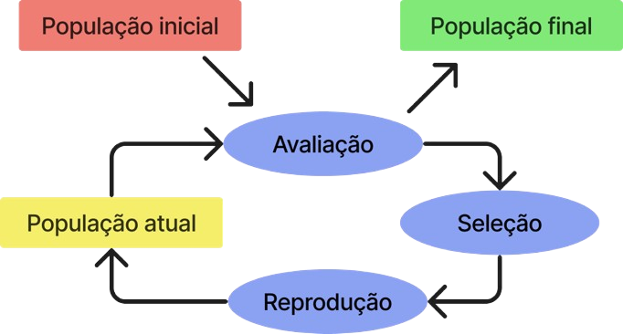
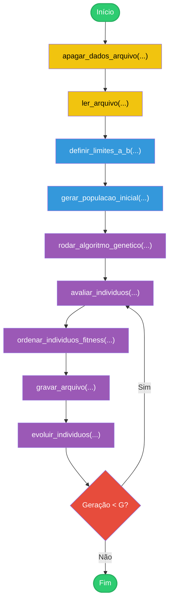
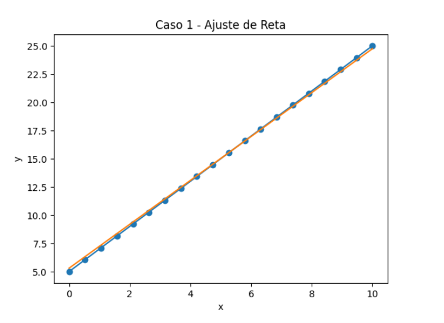
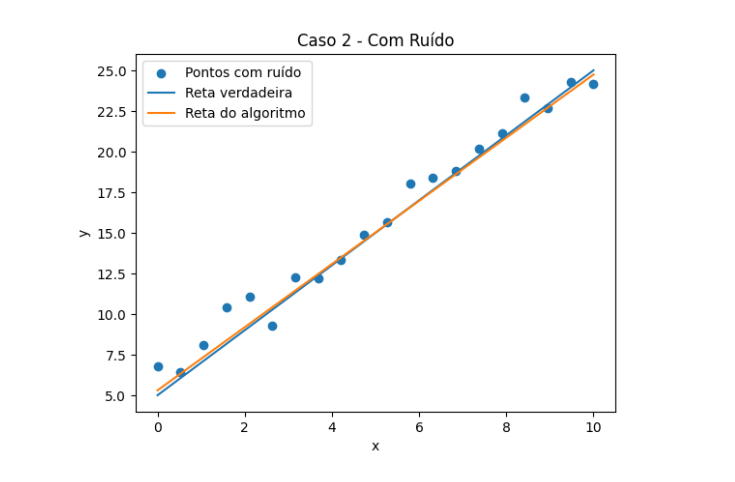
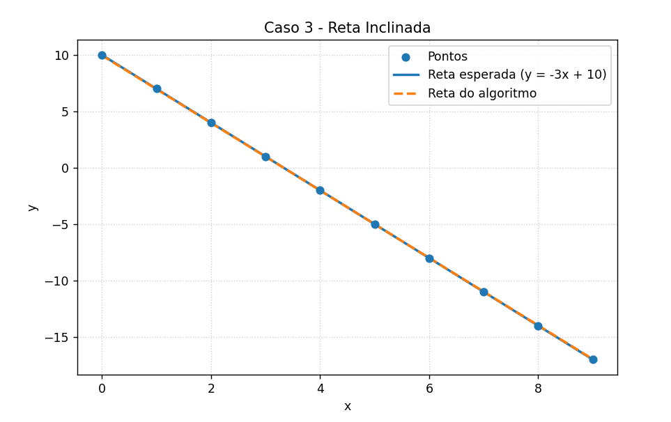
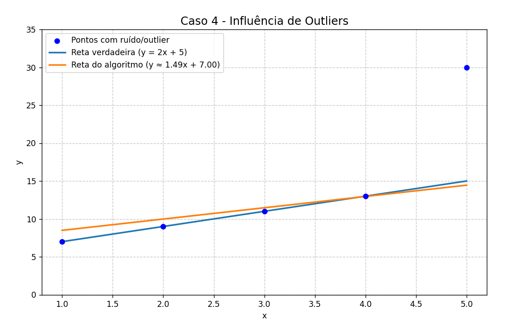

<div align="center">
  <h1>Algoritmo Genético para Ajuste de Função Linear</h1>
  
</div>

## 📗 Introdução
A implementação de um Algoritmo Genético para Ajuste de Função Linear foi proposto pelo professor Michael Pires da Silva como o trabalho de aquecimento para a disciplina de Algoritmos e Estruturas de Dados I do curso de Engenharia de Computação - Centro Federal de Educação Tecnológica de Minas Gerais - Campus V.

O trabalho visa consolidar habilidades fundamentais da linguagem C, como manipulação de 
vetores e matrizes, uso de alocação dinâmica de memória, aritmética de ponteiros e 
organização modular do código. Para isso, utiliza como contexto prático a implementação 
de um Algoritmo Genético (AG) simplificado aplicado a um problema de ajuste de parâmetros.

O foco principal não é a teoria evolutiva, mas sim a forma como soluções candidatas são 
representadas, avaliadas e modificadas iterativamente por meio de operações sobre vetores, 
permitindo que o desenvolvimento esteja centrado na implementação eficiente das estruturas 
e rotinas necessárias.

## 📋 Problema Proposto
Algoritmos Genéticos (AGs) são métodos meta-heurísticos inspirados na teoria darwinista da evolução natural, propostos por J.H. Holland em 1992. Funcionam de forma iterativa, evoluindo uma população de indivíduos onde cada um representa uma solução candidata para o problema. A cada geração, os melhores indivíduos são selecionados pela função de aptidão (fitness) e submetidos a operadores genéticos de crossover e mutação, visando produzir novos indivíduos a partir do material genético de seus pais. O processo se repete até atingir a condição de parada definida, podendo ser um número definido de gerações, uma detecção de convergência ou tempo de execução do AG.

O problema explorado consiste em utilizar este método para encontrar uma reta na forma
<div align="center">

### y = ax + b

</div>
que se ajuste da melhor forma possível ao conjunto de pontos fornecidos como entrada.<br><br>

Os coeficientes **a** (inclinação) e **b** (intercepto) representam os genes de cada indivíduo da população. O objetivo do algoritmo é evoluir esses coeficientes ao longo das gerações, minimizando o erro médio absoluto (MAE) entre os valores estimados pela reta e os pontos reais fornecidos.

## 📂 Organização no repositório
```
Trabalho-Aquecimento-AEDES1/
├── build/
├── src/
│   ├── algoritmo_genetico.h
│   ├── algoritmo_genetico.c
│   ├── manipulacao_arquivos.h
│   ├── manipulacao_arquivos.c
│   ├── calculos.h
│   ├── calculos.c
│   ├── main.c
│   ├── estruturas.h
├── img/
|   ├── algoritmo_g.png
│   ├── caso1.png
│   ├── caso2.png
│   ├── caso3.png
│   ├── caso4.png
├── input.dat
├── output.dat
├── Makefile
├── .gitignore
├── readme.md
```

## 🗃️ Bibliotecas utilizadas
Para o desenvolvimento do projeto, foram utilizadas as seguintes bibliotecas da linguagem C:
  - **`stdio.h`** — entrada e saída padrão
  - **`stdlib.h`** — alocação de memória, geração de números aleatórios (rand(), srand())
  - **`math.h`** — funções matemáticas (fabs, isnan, isinf)

## 📥 Entrada de dados
Formato esperado do arquivo de entrada (`input.dat`):
```
n m G
x1 y1
x2 y2
...
xn yn
```
Onde:
- **n** — quantidade de pontos
- **m** — tamanho da população
- **G** — número de gerações
- **xn, yn** — coordenadas de cada ponto


## ⚙️ Implementação 
A implementação do algoritmo é dividida em várias etapas:
### 🗂️ Módulos do projeto
O projeto é organizado nos seguintes módulos:

- **main.c** — ponto de entrada do programa
- **algoritmo_genetico.c** — módulo principal do AG (seleção, crossover, mutação)
- **calculos.c** — módulo de cálculos (fitness, erro MAE, limites)
- **manipulacao_arquivos.c** — módulo de leitura e escrita de arquivos
- **estruturas.h** — definição das estruturas de dados utilizadas

### 🧩 Estruturas de dados 
Todas as estruturas de dados utilizadas estão no arquivo [`estruturas.h`](https://github.com/Ritaa-Marie/Trabalho-Aquecimento-AEDES1/blob/df6b4aa41d6411a52f663820a1185e48144b414b/src/estruturas.h#L1-L48):

- **`Ponto:`** Representa um ponto no plano cartesiano com coordenadas `x` e `y`.
```
typedef struct ponto{
    float x;
    float y;
} Ponto;
```

- **`DadosEntrada:`** Armazena os dados lidos do arquivo de entrada: número de pontos `n`, tamanho da população `m`, número de gerações `G` e o vetor de pontos.
```
typedef struct dadosEntrada{
    int n;
    int m;
    int G;
    Ponto *pontos;
} DadosEntrada;
```

- **`Individuo:`** Representa um indivíduo da população. Contém os coeficientes `a` e `b` da reta e o valor de `fitness`.
```
typedef struct individuo {
    float a;
    float b;
    float fitness;
}Individuo;
 ```
- **`Limites:`** Armazena os limites do espaço de busca para os coeficientes `a` e `b`, calculados a partir dos pontos de entrada.
```
typedef struct limites {
    float maiorX;
    float menorX;
    float maiorY;
    float menorY;
    float diferencaX;
    float diferencaY;
    float limiteA;
    float menorB;
    float maiorB;
    float diferencaB;
    float menorA;
    float maiorA;
} Limites;
```
- **`GravarDados:`** Armazena os dados do melhor indivíduo de cada população para serem gravados no arquivo de saída.
```
typedef struct gravarDados{
    int geracao;
    float fitness;
    float erro;
    float a;
    float b;
} GravarDados;
```
Além das estruturas definidas em `estruturas.h`, o programa utiliza vetores alocados dinamicamente para manipular a população (`populacao`), os indivíduos ordenados (`individuos_ordenados`), a nova população (`nova_pop`) e o vetor de pontos armazenado dentro da estrutura `DadosEntrada`. Todos esses vetores são inicializados e liberados no `main`.

### 📄 manipulacao_arquivos.c

Funções:
### - [`ler_arquivo (Tipo: int, Parâmetros: const char *input, DadosEntrada *dadosEntrada)`](https://github.com/Ritaa-Marie/Trabalho-Aquecimento-AEDES1/blob/df6b4aa41d6411a52f663820a1185e48144b414b/src/manipulacao_arquivos.c#L5-L44)
    
  > Responsável por abrir e ler o arquivo de entrada (`input.dat`), extraindo e validando os parâmetros do algoritmo — número de pontos (`n`), tamanho da população (`m`) e número de gerações (`G`) — além das coordenadas de cada ponto, armazenando tudo na estrutura `DadosEntrada`.

#### 💡 Funcionamento  
  - Abre o arquivo de entrada por meio de um ponteiro e verifica se a abertura foi bem-sucedida. Em seguida, valida se a primeira linha contém exatamente três valores inteiros positivos (`n`, `m`, `G`), encerrando o programa com mensagem de erro caso contrário. Após a validação, aloca dinamicamente o vetor de pontos e verifica se a alocação foi bem-sucedida. Por fim, percorre cada linha restante do arquivo lendo as coordenadas de cada ponto. Se alguma linha estiver incompleta ou inválida, ou o valor de `n` for maior do que o número de pontos, o programa é encerrado. Concluída a leitura com sucesso, o arquivo é fechado e a estrutura `DadosEntrada` está pronta para uso.

#### 🔄 Retorno  
 - Retorna `1` em caso de erro na leitura ou validação dos dados, e `0` em caso de sucesso.

### - [`gravar_arquivo (Tipo: int, Parâmetro: GravarDados *d)`](https://github.com/Ritaa-Marie/Trabalho-Aquecimento-AEDES1/blob/df6b4aa41d6411a52f663820a1185e48144b414b/src/manipulacao_arquivos.c#L47-L59)
    
  > Responsável por gravar no arquivo de saída (`output.dat`) os dados do melhor indivíduo de cada geração — coeficientes `a` e `b`, erro médio absoluto e fitness — recebidos através da estrutura `GravarDados`.

#### 💡 Funcionamento  
  - Abre o arquivo de saída por meio de um ponteiro, em modo de adição (`"a"`), criando-o caso não exista, e verifica se a abertura foi bem-sucedida. Se sim, grava uma nova linha formatada com os dados da geração atual. Ao final, fecha o arquivo.

#### 🔄 Retorno  
 - Retorna `1` em caso de erro na abertura do arquivo, e `0` em caso de sucesso.

### - [`apagar_dados_arquivo (Tipo: int, Parâmetro: const char *nome_arquivo)`](https://github.com/Ritaa-Marie/Trabalho-Aquecimento-AEDES1/blob/df6b4aa41d6411a52f663820a1185e48144b414b/src/manipulacao_arquivos.c#L62-L73)
    
  > Responsável por limpar o conteúdo do arquivo de saída (`output.dat`) antes de cada execução, evitando o acúmulo de resultados de execuções anteriores.

#### 💡 Funcionamento  
  - Abre o arquivo de saída por meio de um ponteiro, em modo de escrita (`"w"`), o que automaticamente sobrescreve o conteúdo existente por vazio, e verifica se a abertura foi bem-sucedida. Ao final, fecha o arquivo.

#### 🔄 Retorno  
 - Retorna `1` em caso de erro na abertura do arquivo, e `0` em caso de sucesso.


### 📄 calculos.c

Funções:
### - [`definir_limites_a_b (Tipo: void, Parâmetros: DadosEntrada *dadosEntrada, Limites *limitesAB)`](https://github.com/Ritaa-Marie/Trabalho-Aquecimento-AEDES1/blob/df6b4aa41d6411a52f663820a1185e48144b414b/src/calculos.c#L8-L43)
    
  > Responsável por definir os limites do espaço de busca para os coeficientes `a` e `b`, com base nos pontos lidos do arquivo de entrada, armazenando os resultados na estrutura `Limites`.

#### 💡 Funcionamento  
  - Inicializa as variáveis `maiorX`, `menorX`, `maiorY` e `menorY` com os valores do primeiro ponto do vetor. Em seguida, percorre todos os pontos determinando os valores máximos e mínimos de `x` e `y`. Calcula a diferença entre o maior e o menor valor de cada eixo, caso alguma diferença seja zero, ela é substituída por `1` para evitar divisão por zero. O limite de `a` é então calculado pela razão entre `diferencaY` e `diferencaX`, baseado na fórmula do coeficiente angular. Por fim, todos os valores são armazenados na estrutura `Limites`, definindo os intervalos de busca como **a ∈ [-limiteA × 2, limiteA × 2]** e **b ∈ [menorY, maiorY]**.


### - [`funcao_reta (Tipo: float, Parâmetros: float a, float b, float x)`](https://github.com/Ritaa-Marie/Trabalho-Aquecimento-AEDES1/blob/df6b4aa41d6411a52f663820a1185e48144b414b/src/calculos.c#L46-L49)
    
  > Representa a equação da reta, calculando o valor de `y` a partir dos coeficientes `a` e `b` e da coordenada `x` fornecidos.

#### 💡 Funcionamento  
  - Substitui os parâmetros recebidos na fórmula **y = (a × x) + b** e retorna o resultado calculado.

#### 🔄 Retorno
  - Retorna o valor de `y` correspondente ao ponto `x` na reta definida pelos coeficientes `a` e `b`.


### - [`calcular_erro_MAE_individuo (Tipo: float, Parâmetros: DadosEntrada *dadosEntrada, Individuo *populacao, int j)`](https://github.com/Ritaa-Marie/Trabalho-Aquecimento-AEDES1/blob/df6b4aa41d6411a52f663820a1185e48144b414b/src/calculos.c#L52-L74)
    
  > Calcula o Erro Médio Absoluto (MAE) entre os valores estimados pela reta do indivíduo `j` e os pontos reais fornecidos como entrada.

#### 💡 Funcionamento  
  - Inicializa `a` e `b` com os coeficientes do indivíduo na posição `j` do vetor população (cada posição corresponde a um `Individuo`). Verifica se algum dos coeficientes é `NaN` ou infinito e caso seja, retorna `INFINITY` imediatamente. Em seguida, percorre todos os pontos de entrada, calculando o valor de `y` pela `funcao_reta` para cada `x`. Se o resultado for `NaN` ou infinito, retorna `INFINITY`. Caso contrário, acumula o valor absoluto da diferença entre o `y` calculado e o `y` real, utilizando a função `fabs()` da biblioteca **math.h**. Ao final do laço, divide o erro acumulado pelo número de pontos `n`, retornando o erro médio absoluto.

#### 🔄 Retorno
  - Retorna o valor do erro médio absoluto (`media_erro_reta`) entre os pontos reais e os estimados pela reta do indivíduo `j`, ou `INFINITY` caso algum valor inválido seja detectado.


### - [`calcular_fitness (Tipo: void, Parâmetros: float erro_medio, Individuo *populacao, int j)`](https://github.com/Ritaa-Marie/Trabalho-Aquecimento-AEDES1/blob/df6b4aa41d6411a52f663820a1185e48144b414b/src/calculos.c#L77-L84)
    
  > Calcula e atualiza o fitness do indivíduo `j` com base no Erro Médio Absoluto (MAE), sendo o fitness inversamente proporcional ao erro, ou seja, quanto menor o erro, maior o fitness.

#### 💡 Funcionamento  
  - Verifica se o erro médio é `NaN` ou infinito e caso ele seja, o fitness do indivíduo `j` é definido como `0.0`, representando o pior indivíduo possível, pois o seu erro é enorme. Caso contrário, o fitness é calculado pela fórmula padrão **fit = 1 / (1 + erro_medio)**, garantindo que indivíduos com menor erro recebam valores de fitness mais próximos de `1`. O resultado é então armazenado diretamente no vetor população na posição `j`.


### - [`ordenar_individuos_fitness (Tipo: void, Parâmetros: DadosEntrada *dadosEntrada, Individuo *populacao, Individuo *individuos_ordenados)`](https://github.com/Ritaa-Marie/Trabalho-Aquecimento-AEDES1/blob/df6b4aa41d6411a52f663820a1185e48144b414b/src/calculos.c#L87-L105)
    
  > Ordena os indivíduos da população em ordem crescente de fitness em um vetor auxiliar, de forma que o melhor indivíduo ocupe a última posição. Utiliza o método de ordenação Bubble Sort.

#### 💡 Funcionamento  
  - Antes de ordenar, verifica se algum fitness é `NaN` e, caso seja, o substitui por `0.0`. Simultaneamente, copia o vetor população para o vetor de ordenação. Em seguida, aplica o Bubble Sort com dois laços aninhados, o externo percorre até o penúltimo elemento, pois o último já estará na posição correta automaticamente, e o interno compara elementos vizinhos, trocando-os de posição caso o fitness anterior seja maior que o posterior, garantindo a ordenação crescente ao final.


### 📄 algoritmo_genetico.c

Funções:
### - [`gerar_populacao_inicial (Tipo: void, Parâmetros: Individuo *populacao, DadosEntrada *dadosEntrada, Limites *limitesAB)`](https://github.com/Ritaa-Marie/Trabalho-Aquecimento-AEDES1/blob/df6b4aa41d6411a52f663820a1185e48144b414b/src/algoritmo_genetico.c#L9-L23)
    
  > Responsável por gerar a população inicial de forma aleatória, dentro dos limites definidos para os coeficientes `a` e `b`, armazenando os indivíduos no vetor população.

#### 💡 Funcionamento  
  - Inicialmente, percorre todos os indivíduos do vetor população zerando todas as variáveis para evitar lixo de memória. Em seguida, percorre novamente o vetor para gerar os coeficientes aleatórios. Esse número aleatório é obtido pela divisão de `rand()` por `RAND_MAX`, resultando em um valor entre `0` e `1`. O coeficiente `a` é calculado somando o menor limite de `a` com o número aleatório multiplicado pela diferença entre os limites, e `b` é gerado da mesma forma. O fitness é definido como `NaN`, pois ainda não foi calculado. Ao final, a população está gerada dentro do espaço de busca definido pelos limites.


### - [`avaliar_individuos (Tipo: void, Parâmetros: DadosEntrada *dadosEntrada, Individuo *populacao)`](https://github.com/Ritaa-Marie/Trabalho-Aquecimento-AEDES1/blob/df6b4aa41d6411a52f663820a1185e48144b414b/src/algoritmo_genetico.c#L26-L31)
    
  > Avalia todos os indivíduos da população, calculando o erro MAE e o fitness de cada um por meio das funções definidas em `calculos.c`.

#### 💡 Funcionamento  
  - Percorre todos os indivíduos do vetor população utilizando o tamanho `m` definido nos dados de entrada. Para cada indivíduo, chama `calcular_erro_MAE_individuo` e armazena o resultado, que em seguida é passado como parâmetro para `calcular_fitness` juntamente com a posição `i`. Ao final, toda a população está devidamente avaliada com seus respectivos erros e fitness.


### - [`crossover (Tipo: void, Parâmetros: Individuo pai1, Individuo pai2, Individuo *novoIndividuoCross, float aleatoriedade)`](https://github.com/Ritaa-Marie/Trabalho-Aquecimento-AEDES1/blob/df6b4aa41d6411a52f663820a1185e48144b414b/src/algoritmo_genetico.c#L34-L51)
    
  > Realiza o cruzamento entre dois indivíduos da população, mesclando seus coeficientes para gerar um novo indivíduo.

#### 💡 Funcionamento  
  - Uma das opções para evoluir o indivíduo é realizando o cruzamento. Inicializa todas as variáveis do novo indivíduo, passado como parâmetro, com `0`. A partir do parâmetro `aleatoriedade`, define qual combinação de genes será utilizada: se o valor for menor ou igual a `0.5`, o novo indivíduo herda o coeficiente `a` do `pai1` e o coeficiente `b` do `pai2`; caso contrário, herda o `a` do `pai2` e o `b` do `pai1`. Por fim, os coeficientes são atribuídos ao novo indivíduo e o fitness é definido como `NaN`, pois ainda não foi calculado.


### - [`mutacao (Tipo: void, Parâmetros: Individuo bom, Individuo *novoIndividuoMut, float aleatoriedade, Limites *limitesAB)`](https://github.com/Ritaa-Marie/Trabalho-Aquecimento-AEDES1/blob/df6b4aa41d6411a52f663820a1185e48144b414b/src/algoritmo_genetico.c#L54-L88)
    
  > Realiza a mutação de um indivíduo bom da população, aplicando uma pequena mudança aleatória em um de seus coeficientes, gerando um novo indivíduo levemente diferente do original.

#### 💡 Funcionamento
 - A outra opção para evoluir o indivíduo é realizando a mutação. Inicializa o novo indivíduo com `0` e copia os coeficientes `a` e `b` do indivíduo `bom`. A partir do parâmetro `aleatoriedade`, define qual coeficiente será mutado, se menor ou igual a `0.5`, o coeficiente `a` é alterado; caso contrário, o coeficiente `b` é alterado.

 - A mutação é calculada pela fórmula **`((rand() / RAND_MAX) - 0.5) × limite × 0.3`**, que gera um valor positivo ou negativo, proporcional ao espaço de busca e limitado a 30% do intervalo, evitando mudanças muito bruscas. Após a mutação, o novo valor é verificado e caso ultrapasse os limites definidos em `Limites`, é definido no limite correspondente. Por fim, o fitness é definido como `NaN`, pois ainda não foi calculado.


### - [`evoluir_individuos (Tipo: void, Parâmetros: DadosEntrada *dadosEntrada, Limites *limitesAB, Individuo *individuos_ordenados, Individuo *nova_pop)`](https://github.com/Ritaa-Marie/Trabalho-Aquecimento-AEDES1/blob/df6b4aa41d6411a52f663820a1185e48144b414b/src/algoritmo_genetico.c#L91-L129)
    
  > Responsável por gerar a nova população, definindo a quantidade de indivíduos que passarão por crossover, mutação ou serão mantidos da geração anterior.

#### 💡 Funcionamento
 - A evolução preserva os 50% melhores indivíduos e substitui os 50% piores por novos. Dos indivíduos a serem substituídos, 30% passam por crossover e os 70% restantes por mutação.

 - Para o crossover, percorre o número de indivíduos definido, gerando aleatoriamente duas posições distintas dentro dos 50% melhores para selecionar `pai1` e `pai2`, garantindo que não sejam o mesmo indivíduo. Em seguida, chama a função `crossover` e armazena o novo indivíduo na nova população.

 - O mesmo processo ocorre para a mutação, percorrendo do fim dos indivíduos cruzados até o total de piores, selecionando aleatoriamente um bom indivíduo diferente do anterior e chamando a função `mutacao`.

 - Por fim, os 50% melhores da população anterior são copiados para a nova população com o fitness definido como `NaN`, pois serão reavaliados na próxima geração.

### - [`rodar_algoritmo_genetico (Tipo: void, Parâmetros: Individuo *populacao, DadosEntrada *dadosEntrada, Limites *limitesAB, Individuo *individuos_ordenados, Individuo *nova_pop)`](https://github.com/Ritaa-Marie/Trabalho-Aquecimento-AEDES1/blob/df6b4aa41d6411a52f663820a1185e48144b414b/src/algoritmo_genetico.c#L131-L156)
    
  > Executa o loop principal do algoritmo genético ao longo de `G` gerações, orquestrando todas as etapas do processo evolutivo.

#### 💡 Funcionamento
 - Em cada geração, avalia todos os indivíduos da população com `avaliar_individuos` e os ordena pelo fitness com `ordenar_individuos_fitness`. Em seguida, coleta os dados do melhor indivíduo, do último do vetor ordenado, recalcula o erro a partir do fitness pela fórmula inversa **(1 / fitness) - 1**, verificando se o fitness é maior que zero para evitar divisão por zero, caso contrário o erro é definido como `INFINITY`. Os dados são então gravados no arquivo de saída com `gravar_arquivo`. Por fim, chama `evoluir_individuos` para gerar a nova população e substitui a população atual pela nova, encerrando o ciclo da geração.


### 📄 main.c

Função: 
### - [`main (Tipo: int)`](https://github.com/Ritaa-Marie/Trabalho-Aquecimento-AEDES1/blob/main/src/main.c#L1-L56)

> Ponto de entrada do programa, responsável por orquestrar todas as etapas do algoritmo genético, desde a leitura dos dados até a liberação da memória.

#### 💡 Funcionamento
Inicialmente, limpa o arquivo de saída com `apagar_dados_arquivo` e lê os dados de entrada com `ler_arquivo`, encerrando o programa em caso de erro em qualquer uma dessas etapas. Em seguida, aloca dinamicamente os vetores de população, indivíduos ordenados e nova população, verificando se cada alocação foi bem-sucedida. Define a semente de aleatoriedade com `srand(SEED)`, calcula os limites de busca com `definir_limites_a_b` e gera a população inicial com `gerar_populacao_inicial`. Por fim, executa o algoritmo genético com `rodar_algoritmo_genetico` e libera toda a memória alocada dinamicamente antes de encerrar.

#### 🔄 Retorno
Retorna `1` em caso de erro na leitura do arquivo ou falha na alocação de memória, e `0` em caso de execução bem-sucedida.

#### 🔔 Observação
- O programa utiliza uma semente fixa de valor `73` para garantir que os resultados sejam reproduzíveis a cada execução. Caso deseje alterá-la, ela está definida no arquivo [`algoritmo_genetico.h`](https://github.com/Ritaa-Marie/Trabalho-Aquecimento-AEDES1/blob/df6b4aa41d6411a52f663820a1185e48144b414b/src/algoritmo_genetico.h).

- Os erros que podem ocorrer durante o programa serão exibidos no terminal.

## 🧬 Ciclo Evolutivo


## 📤 Saída de dados
O arquivo de saída (`output.dat`) registra os valores do melhor indivíduo de cada geração. A cada compilação e execução do programa, os dados desse arquivo serão sobrescritos com os resultados da próxima execução.
```
GERAÇÃO 1: (a = y, b = z) | ERRO: w | MELHOR FITNESS: v
...
GERAÇÃO m: (a = y, b = z) | ERRO: w | MELHOR FITNESS: v
```
Onde:
- **a** — melhor valor do coeficiente angular
- **b** — melhor valor do coeficiente linear
- **ERRO** — erro calculado pelo MAE
- **FITNESS** — melhor fitness da geração


## 👩🏽‍💻 Ambiente de criação e de testes
Para o desenvolvimento do código, foram utilizadas as seguintes ferramentas:
- **Sistema Operacional:** WSL 2.6.3.0 - Ubuntu 20.04.6 LTS (base Windows 11)
- **Compilador:** gcc 9.4.0
- **Editor:** VSCode 1.108.2
- **Linguagem:** C (C17)
- **Hardware:**
  - Notebook: LG Gram 15
  - CPU: Intel Core i7-8550U @ 1.80GHz (8 Núcleos)
  - RAM: 8 GB 

## 🔨🖥️ Compilação e Execução

### ✅ Pré-requisitos
>[!NOTE]
>Para garantir o funcionamento correto dos comandos do **Makefile**, é recomendado o uso de uma distribuição Linux ou do Windows Subsystem for Linux (WSL), ambientes nos quais o shell/bash está disponível.

**Instalar dependências**: <br><br>
Inicialmente, em ambiente shell, garanta que os seguintes comandos foram executados: 
- Atualiza os pacotes antes da instalação
```
sudo apt update
```
- Instala o compilador gcc e o Make, caso necessário
```
sudo apt install build-essential
```
### 🛠️ Modo de Compilação
**Clone o repositório**:
```
git clone https://github.com/Ritaa-Marie/Trabalho-Aquecimento-AEDES1.git
cd Trabalho-Aquecimento-AEDES1
```
**Compile e execute o projeto**: <br><br>
Execute os seguintes comandos para limpar, compilar e rodar, respectivamente, o algoritmo
- Remove o executável anterior e a pasta build
```
make clean
```
- Ao compilar, será gerada a pasta build com o executável dentro
```
make
```
- Execute o programa após a compilação
```
make run
```
- Ou use este comando para realizar as três funções anteriores juntas
```
make compilar
```
O algoritmo estará pronto para ser testado.


## 🧪👩🏽‍🔬 Estudo de casos
Em todos os testes foram usados o número de populações igual a 50 (`m`) e o número de gerações (`G`) igual a 100.
### 🔬 Caso 1 - Função sem ruído
#### 🎯Função alvo
Ajustar uma função linear do tipo: `y = 2x + 5`
#### 📥 Dados de entrada (input.dat)
```
10 50 100
0 5
1 7
2 9
3 11
4 13
5 15
6 17
7 19
8 21
9 23
```
#### 📈 Evolução
```
Geração 1 → erro = 16.06
Geração 10 → erro = 0.027
Geração 40 → erro = 0.012
Geração 100 → erro = 0.007
```

#### 📤 Resultado obtido
**Geração 100:**
```
a = 1.997135
b = 5.013276
erro = 0.007161
fitness = 0.992890
```

<div align="center">
  
</div>

### 🔬 Caso 2 - Função com ruído
#### 🎯Função alvo
Ajustar uma função linear do tipo: `y = 2x + 5 + ε`. Neste experimento, foi adicionado ruído aos dados para simular situações reais onde há variação nas medições.
#### 📥 Dados de entrada (input.dat)
```
10 50 100
0 5.3
1 6.8
2 9.5
3 10.7
4 13.2
5 14.6
6 17.4
7 18.9
8 21.7
9 22.5
```
#### 📈 Evolução
```
Geração 1 → erro = 15.19
Geração 10 → erro = 0.35
Geração 40 → erro = 0.3322
Geração 100 → erro = 0.3321
```

#### 📤 Resultado obtido
**Geração 100:**
```
a ≈ 1.944
b ≈ 5.300
erro ≈ 0.332
fitness ≈ 0.750
```

<div align="center">
  
</div>

### 🔬 Caso 3 - Função com inclinação negativa
#### 🎯Função alvo
Ajustar uma função linear do tipo: `y = -3x + 10`
#### 📥 Dados de entrada (input.dat)
```
10 50 100
0 10
1 7
2 4
3 1
4 -2
5 -5
6 -8
7 -11
8 -14
9 -17
```
#### 📈 Evolução
```
Geração 1 → erro = 32.14
Geração 10 → erro = 12.35
Geração 40 → erro = 1.08
Geração 100 → erro = 0.02
```

#### 📤 Resultado obtido
**Geração 100:**
```
a ≈ -2.991560
b ≈ 9.960724
erro ≈ 0.021099
fitness ≈ 0.979337
```

<div align="center">
  
</div>

### 🔬 Caso 4 - Função Linear com Outlier
#### 🎯Função alvo
Ajustar uma função linear do tipo:`f(x) = 2x + 5`. Porém, um dos pontos foi fortemente distorcido (outlier).
 
#### 📥 Dados de entrada (input.dat)
```
5 50 100
1 7
2 9
3 11
4 13
5 30
```
#### 📈 Evolução
```
Geração 1 → erro = 39.97
Geração 10 → erro = 9.63
Geração 40 → erro = 3.70
Geração 100 → erro = 3.70
```

#### 📤 Resultado obtido
**Geração 100:**
```
a ≈ 1.49
b ≈ 7.00
erro ≈ 3.70
fitness ≈ 0.212587
```
<div align="center">
  
</div>


## Considerações Finais
Ao longo dos testes, foi possível observar bem como o algoritmo genético se comporta em diferentes situações. No caso mais simples, sem ruído, o algoritmo apresentou excelente desempenho. A reta encontrada ficou muito próxima da reta real, e o erro foi quase zero, mostrando que funciona muito bem em condições ideais. Quando foi adicionado ruído aos dados, os pontos ficaram mais espalhados, como esperado. Mesmo assim, o algoritmo ainda conseguiu encontrar uma boa aproximação da reta, o que mostra que ele é relativamente robusto a pequenas variações.

Testando com outros tipos de dados, como inclinação negativa, o algoritmo também conseguiu se adaptar e encontrar soluções coerentes, indicando que ele não depende de um único padrão específico. Por outro lado, quando foi inserido um outlier, o comportamento mudou bastante. O erro aumentou e o algoritmo teve mais dificuldade para encontrar uma boa solução. Isso acontece porque esse ponto fora do padrão “puxa” a reta e acaba prejudicando o ajuste geral.

No geral, conclui-se que o algoritmo genético funciona bem para ajuste de funções lineares, principalmente quando os dados são consistentes. Porém, ele é sensível a valores muito discrepantes e valores extremos, o que pode impactar diretamente no resultado final.

## 📊 Análise de complexidade
As variáveis utilizadas são:
```
n = número de pontos
m = tamanho da população
G = número de gerações
```
### ⌛ Funções individuais
| Função | Complexidade | Motivo |
| :--- | :---: | :--- |
| `ler_arquivo` | $O(n)$ | Percorre n pontos |
| `apagar_dados_arquivo` | $O(1)$ | Apenas abre e fecha o arquivo |
| `gravar_arquivo` | $O(1)$ | Grava uma linha fixa |
| `definir_limites_a_b` | $O(n)$ | Percorre n pontos |
| `funcao_reta` | $O(1)$ | Calcula direto |
| `calcular_fitness` | $O(1)$ | Calcula direto |
| `calcular_erro_MAE_individuo` | $O(n)$ | Percorre n pontos |
| `gerar_populacao_inicial` | $O(m)$ | Percorre m indivíduos |
| `avaliar_individuos` | $O(m \times n)$ | m indivíduos $\times$ n pontos cada |
| `ordenar_individuos_fitness` | $O(m^2)$ | Bubble Sort |
| `crossover` | $O(1)$ | Operações diretas |
| `mutacao` | $O(1)$ | Operações diretas |
| `evoluir_individuos` | $O(m)$ | Percorre m indivíduos |

### 📐 Função principal 
A cada geração, são executadas as seguintes etapas em `rodar_algoritmo_genetico`:
| Etapa | Complexidade |
| :--- | :---: |
| **Avaliação** (`avaliar_individuos`) | $O(m \times n)$ |
| **Ordenação** (`ordenar_individuos_fitness`) | $O(m^2)$ |
| **Gravação** (`gravar_arquivo`) | $O(1)$ |
| **Evolução** (`evoluir_individuos`) | $O(m)$ |
| **Substituição da população** | $O(m)$ |

### 📌 Complexidade total
| Etapa | Complexidade |
| :--- | :---: |
| **Leitura e inicialização** | $O(n + m)$ |
| **Loop principal** | $O(G \times (m \times n + m^2))$ |
| **Total** | $O(G \cdot (m \cdot n + m^2))$ |

A análise de complexidade do algoritmo indica que o custo computacional total é definido pela expressão $O(G \cdot (m \cdot n + m^2))$, o que reflete uma dependência direta entre o número de gerações (`G`) e o tamanho da população (`m`). Observa-se que, enquanto as funções de inicialização e mutação possuem baixo impacto, o processo de avaliação dos indivíduos ($m \cdot n$) e a ordenação via Bubble Sort ($m^2$) atuam como os principais gargalos do sistema. 

## 💭 Melhorias
Apesar de o algoritmo apresentar bons resultados, algumas melhorias podem ser propostas para torná-lo mais eficiente e robusto. Um dos principais pontos é a substituição do método de ordenação atual (Bubble Sort) por algoritmos mais eficientes, reduzindo a complexidade total. Além disso, pode-se aprimorar o processo de mutação, tornando-o adaptativo ao longo das gerações, de forma a equilibrar melhor exploração e refinamento da busca. Também seria interessante utilizar diferentes funções de erro (como erro quadrático médio) ou tratar melhor a presença de outliers nos dados. Por fim, ajustes dinâmicos nos parâmetros do algoritmo, como taxa de crossover e mutação, podem contribuir para uma convergência mais rápida e estável.

## 🔗 Referências
W3SCHOOLS. **C Files**. Disponível em: https://www.w3schools.com/c. Acesso em: 23 mar. 2026.<br>
KATO, Rodrigo. **Algoritmos Genéticos**. Disponível em: https://bioinfo.com.br/algoritmos-geneticos/. Acesso em: 02 abr. 2026.

## 🫱🏽‍🫲🏽 Créditos
Agradeço ao professor Michael Pires da Silva por disponibilizar o modelo do Makefile e por todas as dúvidas sanadas. Agradeço também a todas as minhas amigas e aos meus amigos que me ajudaram a entender melhor a proposta.

## 📧 Contato
Autora: Rita Mariê Amaral Siqueira

- Email: (ritamariecajuru@gmail.com)
- GitHub: [Ritaa-Marie](https://github.com/Ritaa-Marie)
- LinkedIn: [Rita Mariê](https://www.linkedin.com/in/rita-mari%C3%AA-amaral-siqueira-567b74357/)
